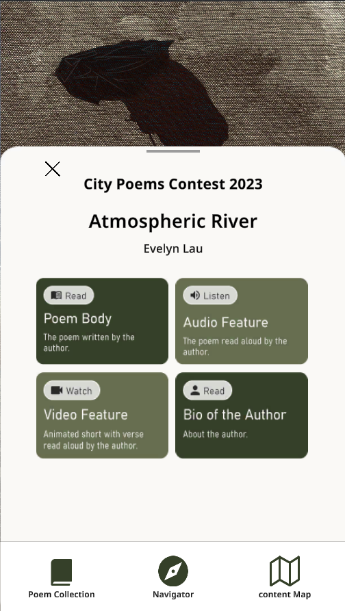
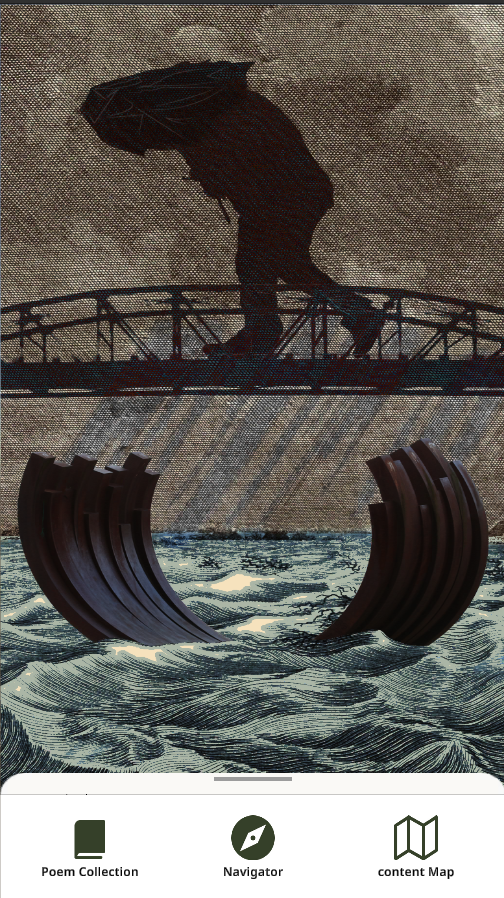

# Welcome to the CEDaR Space Github

CEDaR is a UBC unit within the Institute for Critical Indigenous studies. Our research focuses on the collaborative development of technologies, tools, and methods  for community-centered revitalization of language and culture. We work with communities through (1) documenting and interpreting their language and culture; (2) developing interactive new media tools and cutting edge applications of natural language processing (NLP) technologies that allow them to mobilize existing materials for teaching, learning, and storytelling; and (3) developing tools and models (user-oriented content management systems and archival databases) for storing and caring for digital materials in the communities where they belong, with attention to ethical stewardship and key principles of data sovereignty.  We also provide multi-media equipment and training to to students as well as resources for project development to faculty and community researchers.

The projects published here are CEDaR's public contributions including scripts for data management, games and websites developed in support of research projects, and contributions to open source language technology projects.

## CEDaR Projects
Here is a summary of our private projects.

### City Poems

This app is a co-creation with CEDaR, a collaborative lab-studio in the Institute for Critical Indigenous Studies at UBC Vancouver, dedicated to developing relational technologies to support community-led storytelling. 

Nine  poems in Metro Vancouver are featured in our first phase of the App, which allows visitors, residents and/or poetry enthusiasts to access the poems and related content from the locations to which they refer.

We are seeking feedback about the user experience from local experts. We are currently focusing on testing its functionality on iPhones or iPads, with Androids to follow. If you would like to test the app and have an iOs device, you can access the app through TestFlight (a platform for testing beta versions of apps on Apple platforms) at this link: [https://testflight.apple.com/join/j8YkPA4B](https://testflight.apple.com/join/j8YkPA4B)

If you have an Android device and want to test City Poems, you can access the alpha test at this link: [https://play.google.com/apps/internaltest/4701679692359207385](https://play.google.com/apps/internaltest/4701679692359207385)

### MOA Interactive Map

</img>

This project was created for display in the UBC Museum of Anthropology. It is currently on display in the Great Hall. It demonstrates the vital peoples and languages of coastal BC through an interactive map that links to text contributions from peoples in the map and language videos and songs.

